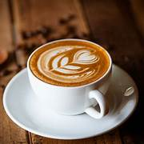
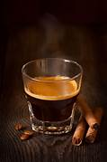
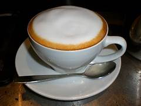
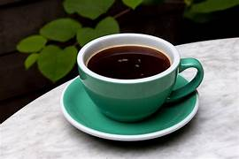
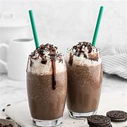
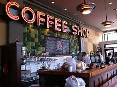

<!DOCTYPE html>
<html>
<head>
    <title>
        COFFEE SHOP
    </title>
    
    <link rel="icon" href="images/favicon.png" type="image/x-icon">
</head>
<body>
   
    <header class="header">
        
        <nav id="navbar">
            
 BREW BLISS

            

                <ul>
                <li>
                    <a href="#about">About</a>
                    <a href="#menu">Menu </a>
                    <a href="#gallery">Gallery</a>
                    <a href="#contact">Contact</a>
                </li>
            </ul>
        

        </nav>
    </header>
    <section class="hero">
        

        <h1> welcome to Brew Bliss</h1>
         
Your perfect cup of coffee awaits for you !

         
Welcome to Brew Bliss, we're delighted to have you here! 
            Discover our finest brews ☕ 😊

        

    </section>
    <section id="about">
        

            <h1>Our Story</h1>
            

                Welcome to Brew Bliss ☕, where every cup tells a story. Nestled in the heart of your city, we are more than just a coffee shop – we’re a haven for coffee enthusiasts ❤️ and a retreat for dreamers.

        

     </section>
     <section id="menu">
        <h1>Your Menu Item Is Here </h1>
         
        
 
        
        <h3>Latte</h3>
        
Rs 140.00

        
        <h3>Espresso</h3>
        
Rs 214.00

        
        <h3>Cappuccino</h3>
        
Rs 184.00

        
        <h3>Americano</h3>
        
Rs 190.00

        
        <h3>Mocha</h3>
        
Rs 250.00

    

     </section>
     <section id="gallery">
        <h1>Gallery</h1>
        

        
            

                
                
Welcome to Our Coffee Haven. Discover the art of coffee through our curated gallery. From the rich aroma of freshly brewed espresso to the delicate swirls of frothy cappuccinos, each cup tells a story of passion and craftsmanship.

            

            

                
More Than Just Coffee. It’s not just about the beverages—it’s about the moments. Whether you’re here for a morning pick-me-up, a cozy afternoon, or a late-night catch-up, our gallery captures the ambiance of every cup shared at our coffee shop.

                
            

        

    </section>
    
     <section id="contact">
        <h2>Contact Us</h2>
        

            
123 Coffee Lane, Espresso City

            
+1 234 567 890

        

         </section>
         <footer>
            
2025 Brew Bliss. All rights reserved.

     </footer>
</body>
</html>
